# Wallet Guardian RN: Cross-Chain Security Automation for the Future

> **Hackathon Vision: A Universal, Automated Wallet Guardian for the Multi-Chain Era**

---

## � What is Wallet Guardian RN?

**Wallet Guardian RN** is a next-generation, cross-chain wallet protection system built on the [Reactive Network](https://dev.reactive.network/). It is designed to automatically monitor your assets across multiple blockchains, detect threats in real time, and trigger emergency actions to secure your funds—no matter where they are.

This project is a hackathon prototype that demonstrates:
- **Automated attack detection** (mocked for demo)
- **Cross-chain event monitoring** (Lasna → Sepolia/Anvil)
- **Emergency fund transfer via smart contract callback**
- **MetaMask-based frontend for user control**
- **A vision for a universal, hyperlane-enabled, multi-chain security layer**

---

## 🌟 Why This Matters

- **Crypto is multi-chain**: Assets live on many chains, but security is fragmented.
- **Attacks are fast and cross-chain**: By the time you notice, it’s too late.
- **Manual response is not enough**: We need automation, monitoring, and instant reaction.
- **Wallet Guardian RN** aims to be the “security autopilot” for your crypto, everywhere.

---

## 🛠️ How Does It Work?

### 1. **Reactive Network Monitoring**
- Deploys a monitoring contract (`WalletGuardianRN`) on Lasna (Reactive Network testnet)
- Subscribes to events on Ethereum Sepolia (or any EVM chain):
  - **Large ERC20 transfers** (potential theft)
  - **Price drops** (market crash)
  - **Liquidations** (DeFi risk)
- Uses Reactive Network’s native cross-chain automation to process these events

### 2. **Cross-Chain Emergency Response**
- When a threat is detected (mocked for demo), the Lasna contract triggers a callback to a contract on the destination chain (Sepolia, Anvil, etc.)
- The callback contract (`WalletGuardianCallback`) executes an emergency transfer to a user’s safe address

### 3. **User Dashboard (Frontend)**
- Connect with MetaMask
- Set up protection policies (amount, thresholds, destination)
- Simulate attacks and test emergency response
- See real blockchain events and cross-chain automation in action

---

## 🎬 Demo Scenario (Hackathon Walkthrough)

1. **User deploys monitoring contract on Lasna**
2. **User deploys callback contract on Sepolia/Anvil**
3. **User connects dashboard, configures protection**
4. **Simulated attack triggers event on Sepolia**
5. **Reactive Network detects event, triggers cross-chain callback**
6. **Funds are moved to user’s safe address automatically**

> **Note:** For the hackathon, attack detection is mocked to show the automation flow. In production, this will use real DeFi and DEX event monitoring.

---

## 🔮 The Future: Hyperlane, Multi-Chain, and Beyond

- **Full Hyperlane Integration**: Monitor and protect assets across *all* EVM and non-EVM chains
- **Real Attack Detection**: Integrate on-chain analytics, AI, and DeFi protocol monitoring
- **Asset-Agnostic Security**: Protect any token, NFT, or DeFi position
- **User-Defined Automation**: Let users set custom triggers and responses
- **Security as a Service**: Offer plug-and-play security for wallets, DAOs, and protocols
- **Open, Extensible, and Community-Driven**

---

## 🏗️ Technical Overview


### Architecture Diagram

```mermaid
flowchart TD
  subgraph MonitoredChain[Sepolia/Anvil/Other EVM Chains]
    E1[User Wallet / DEX / DeFi Protocols]
    E2[Events: ERC20 Transfer, Price Drop, Liquidation]
  end
  subgraph ReactiveNetwork[Reactive Network: Lasna Testnet]
    R1[WalletGuardianRN Contract]
    R2[Event Processing & Threat Detection]
  end
  subgraph DestinationChain[Sepolia/Anvil/etc]
    D1[WalletGuardianCallback Contract]
    D2[Emergency Transfer]
    D3[User’s Safe Address]
  end
  E1-->|Generates|E2
  E2-->|Monitored by|R1
  R1-->|Triggers|R2
  R2-->|Cross-chain Callback|D1
  D1-->|Executes|D2
  D2-->|Sends Funds|D3
```



### Key Components
- **WalletGuardianRN.sol**: Monitors events, processes threats, triggers cross-chain callbacks
- **WalletGuardianCallback.sol**: Receives callbacks, executes emergency transfers
- **Frontend Dashboard**: MetaMask integration, policy setup, attack simulation

---

### 🧩 Implementation Details: The Reactive Part

- **Event Subscriptions**: The `WalletGuardianRN` contract on Lasna subscribes to event topics (ERC20 Transfer, Uniswap Sync, Liquidation) on the monitored chain (e.g., Sepolia).
- **Threat Detection Logic**: For the hackathon, threat detection is mocked (simulated via UI or test scripts). In production, the contract would parse event data and apply rules (e.g., large transfer, price drop).
- **Cross-Chain Automation**: When a threat is detected, the contract uses Reactive Network’s native callback mechanism to trigger a function on the destination chain (e.g., `executeEmergencyTransfer` on Sepolia/Anvil).
- **Security**: Only authorized contracts can trigger the callback. All sensitive actions are gated by access control.
- **Extensibility**: The system is designed to add more event types, chains, and custom user rules in the future.

---

## 🧪 Local Testing (Current Status)

> **We have not yet deployed to public testnets. All testing so far is local.**

### Local Test Flow
1. **Start Anvil**: Local Ethereum testnet (`anvil`)
2. **Deploy Contracts**: Deploy `WalletGuardianCallback` and mock contracts to Anvil
3. **Run Dashboard**: Open `test-dashboard.html`, connect MetaMask to Anvil
4. **Simulate Attack**: Use dashboard or scripts to generate ERC20 Transfer events
5. **Reactive Logic**: (Mocked) The system detects the event and triggers the emergency transfer locally
6. **Verify**: Funds are moved to the safe address on Anvil

---

## 🌍 Next Steps: Testnet Deployment

- **Deploy monitoring contract on Lasna (Reactive Network testnet)**
- **Deploy callback contract on Sepolia (Ethereum testnet)**
- **Update dashboard and .env with deployed addresses**
- **Test full cross-chain automation on public testnets**

---

---

## 🧪 How to Run the Demo

### Prerequisites
- [Foundry](https://book.getfoundry.sh/) (for contract deployment)
- [Node.js](https://nodejs.org/) (for frontend)
- MetaMask (for wallet interaction)
- Lasna testnet funds ([Faucet](https://lasna-faucet.rnk.dev/))

### 1. Environment Setup
- Copy `.env.example` to `.env` and fill in:
  - `PRIVATE_KEY` (Lasna-funded account)
  - `SYSTEM_CONTRACT_ADDR` (Lasna system contract)
  - `REACTIVE_RPC` (Lasna RPC)
  - `CALLBACK_PROXY_ADDR` (deployed callback contract address)
  - `DESTINATION_RPC` (Sepolia/Anvil RPC)

### 2. Deploy Contracts
- **On Lasna (Reactive Network):**
  ```bash
  forge script scripts/deployReactive.s.sol --rpc-url $REACTIVE_RPC --broadcast --chain-id 167008 --private-key $PRIVATE_KEY
  ```
- **On Sepolia/Anvil:**
  ```bash
  forge script scripts/deploy.s.sol --rpc-url $DESTINATION_RPC --broadcast
  ```

### 3. Run the Frontend
- Open `test-dashboard.html` in your browser (or run a local server)
- Connect MetaMask, set up protection, and simulate attacks

---

## �️ Security Notes
- **Private keys**: Never commit to version control
- **Thresholds**: Tune carefully to avoid false positives/negatives
- **Callback authorization**: Only allow trusted senders
- **Emergency pause**: Admin controls for halting automation

---

## � Resources & Inspiration
- [Reactive Network Docs](https://dev.reactive.network/)
- [Reactive Network Examples](https://github.com/Reactive-Network/reactive-smart-contract-demos)
- [Hyperlane](https://www.hyperlane.xyz/)
- [Foundry Book](https://book.getfoundry.sh/)

---

## ⚠️ Disclaimer
This is a hackathon prototype. Attack detection is mocked for demo. Do not use with real funds. The vision is to build a universal, automated, cross-chain wallet guardian for the next era of crypto security.
